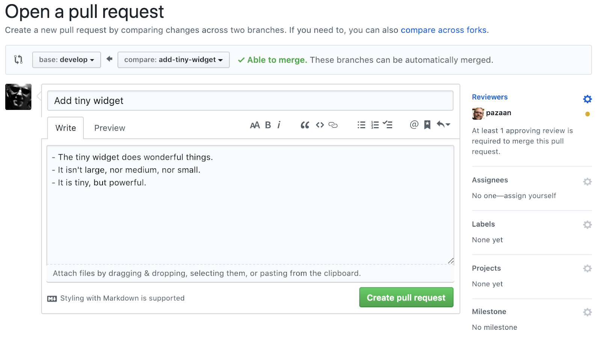
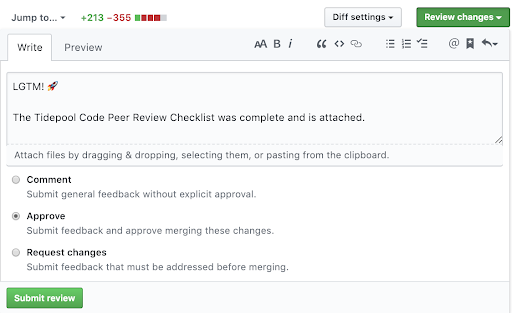

# Tidepool Development Process

Note: in late 2018, Tidepool switched to a new Git branching model that is very similar to [GitFlow]. The primary differences are the inclusion of required peer reviews for any merge into the `master` or `develop` branch and all tags are applied on release and hotfix branches, not the `master` branch. These relatively minor differences from GitFlow are necessary to accommodate the Tidepool GitHub branch protection requirements.

This document describes the overall development process, including Git branching model, from start to finish. Each specific repository will likely use a slightly modified development process to accommodate language and/or framework requirements. These differences will be highlighted in the repository `README.md`.

This document assumes you already have a good working knowledge of using Git for software development. In fact, this document does not include all of the Git commands you will need to use during the normal development process. In particular how to add files, remove files, and create commits. If you don't have this knowledge, please learn that first!

For the remainder of this document, all examples assume that the repository name is `widgets`, the feature branch name is `add-tiny-widget`, the release version is `v1.4.0`, and the hotfix version is `v1.4.1`.

## Setup Repository

If starting development on a brand new Tidepool repository, follow the instructions in the [Tidepool GitHub Processes] document. This will create the repository with the default Tidepool settings, create the `develop` branch, and configure both the `master` and `develop` branch with the required branch protection settings.

Clone the repository to your local machine. For example:

```bash
$ mkdir tidepool
$ cd tidepool
$ git clone git@github.com:tidepool-org/widgets.git
```

## Feature Development

Developing a new feature requires following several well-defined steps to ensure an orderly development process.

### Create Feature Branch

Create a new feature branch off the latest `develop` branch. The feature branch name should accurately, but briefly, describe the feature. Use *only* lowercase ASCII letters, numbers, and dashes (not underscores, periods or any other symbols) in the branch name. For example:

```bash
$ git checkout develop
$ git pull
$ git checkout -b add-tiny-widget develop
```

### Develop Feature

Develop the new feature. Add unit tests to fully test the new feature. Ensure *all* tests pass. Manually test the feature, as necessary. Ensure the new feature matches all done criteria from the related Trello card. Perform the [Tidepool Code Peer Review Checklist] process on the completed code to ensure everything it as it should be.

Use standard git operations to add files, remove files, and create commits. Commit the feature code into one or more commits. Each commit should preferably be a single completed unit of work so that, if pushed to `origin` independently, the Continuous Integration system would build successfully and all tests would pass. Each commit title and description should accurately and completely describe, at a high-level, the changes contained within the commit.

If you prefer to use Git to commit code frequently, even if it is incomplete or does not work, perhaps for "backup" purposes or just because it is the end of the day, please consider rebasing your feature branch and squash code into one commit per completed and tested unit of work. Remember that once commits are merged back into the `develop` and `master` branches they are a permanent part of git history for the entire world to see.

On the other hand, do not unnecessarily squash a set of unrelated work into a single commit. This makes a peer review considerably more difficult. So, strive for a balance of focused, but complete commits.

For example, if you need to refactor code before you can implement a new feature, it would make sense to have one commit for the refactor (and still have a functioning project) and one commit for the new feature after the refactor. This will make the review easier and may help isolate whether a newly introduced bug is part of the refactor or the new feature.

**Note**: If you ever rebase a feature branch that has already been pushed to `origin`, do **not** force push the branch (i.e. do **not** use `-f` or `--force` with git push). Instead, create a new feature branch with the same name but append a "dot number" to the end. For example, if the feature branch was `add-tiny-widget` then any rebased branches would follow the pattern `add-tiny-widget.1`, `add-tiny-widget.2`, `add-tiny-widget.3`, etc. Delete the previous branch both locally and remotely once you have pushed the new rebased branch. Continue working with the new rebased branch.

### Merge Latest Develop Branch into Feature Branch

Once you are confident that the feature branch is complete and ready for review, perform a final merge of the `develop` branch into the feature branch, as it may have changed since you originally created the feature branch. For example:

```bash
$ git checkout develop
$ git pull
$ git checkout add-tiny-widget
$ git merge --no-ff develop
```

Manually resolve any conflicts. Since there may have been automatic or manually resolved conflicts, review any changes and perform a final, full test of the code. All tests must pass.

### Push Feature Branch

Now that you are certain the feature branch is complete and contains the latest from the `develop` branch, push the completed feature branch to `origin`, if you have not already done so. For example:

```bash
$ git push -u origin add-tiny-widget
```

### Deploy Feature Branch (Optional)

Rarely it will be necessary to deploy an in-progress feature branch. Typically this would be to test a specific condition only present when deployed or released. If this occurs, use a feature branch label or tag of the form `v<version>-<feature-branch-name>.<number>`, where `<version>` is the version of the active release branch or, if no active release branch is present, the latest deployed version, and `<number>` starts at 1 and allows for multiple labels or tags. The version should follow [Semantic Versioning 2.0.0] rules. A feature branch label or tag of this form is still a valid Semantic Version. Note the `v` prefix. For example, `v1.4.0-add-tiny-widget.1`.

### Peer Review Feature Branch into Develop Branch

Once you have pushed the completed feature branch to `origin` and verified that any CI build completes successfully, create a pull request for the peer review. Use either the GitHub Web interface or the command line to create the pull request. For example:

```bash
$ open https://github.com/tidepool-org/widgets/pull/new/develop...add-tiny-widget
```

Ensure the base branch is `develop` and the compare branch is your *final* feature branch, particularly if you have rebased one or more times.

Update the title and description, if desired. It may be helpful to add extra notes for the peer reviewer.

In the upper right corner, add one or more Reviewers for this pull request. We no longer specify reviewers via @mentions in the description, but instead use the GitHub Reviewers mechanism.

Generally, only one reviewer is required per pull request. However, if you desire multiple reviewers, then **all reviewers must review and approve the pull request**. If you are specified as a reviewer, then you **must review and approve the pull request even if there are other reviewers**. It is not "one of", it is "all". We want to prevent the situation where the reviewers all think someone else is doing the review.

If you aren't sure who should review the pull request, then determine that outside of GitHub (e.g. via Slack) *before* creating the pull request. We want it to be abundantly clear who is responsible for reviewer the pull request.

For example:



Note the pull request reviewer is set to `pazaan` in the upper right corner.

Click `Create pull request`. You may wish to notify the reviewer of the pull request via Slack.

Add the pull request to the Trello card via the GitHub Power-Up.

If you are a requested reviewer, but you will not be able to perform the review in a timely manner, please reach out to the requestor and explain the situation. The requestor may be fine waiting or may decide to choose another reviewer.

The reviewer should use the [Tidepool Code Peer Review Checklist] to help perform the peer review.

Coordinate with the reviewer to discuss any questions, comments or suggestions. Strive to keep all questions, comments, suggestions, and final decisions in the pull request comment stream so the entire peer review is contained within the pull request itself for future reference. It is acceptable to have in-depth side conversations outside of the pull request (e.g. Slack, email, video chat), but, at a minimum, capture the initial issue, final decision, and its rationale in the pull request comments.

If desired or necessary, update your feature branch and commit any changes. Once complete, follow Push Feature Branch instructions. You may also need to follow Merge Latest Develop Branch into Feature Branch instructions before pushing if the `develop` branch has recently changed.

Once you and the reviewer are satisfied with the results, the reviewer should approve your pull request and attach the completed [Tidepool Code Peer Review Checklist].

For example:



### Merge Feature Branch into Develop Branch

Once the pull request is approved, the finished feature branch may be merged into the `develop` branch to definitely add it to the upcoming release.

If the `develop` branch has changed since you last merged then follow Merge Latest Develop Branch into Feature Branch, Push Feature Branch, and Peer Review Feature Branch instructions again. (The reviewer does not need to complete a full review, but does need to review and approve the final merged code for any issues with possible merge conflicts. This is enforced by the required GitHub branch protection settings.)

Merge the feature branch into the `develop` branch. For example:

```bash
$ git checkout develop
$ git pull
$ git merge --no-ff add-tiny-widget
$ git push origin develop
```

The `--no-ff` flag forces the merge to always create a new commit, even if
the merge could be performed with a fast-forward. This avoids losing
information about the historical existence of the feature branch.

### Delete Feature Branch

Assuming the merge and push were successful, delete the feature branch.
For example:

```bash
$ git branch -d add-tiny-widget
$ git push origin :add-tiny-widget
```

## Release Process

### Create Release Branch from Develop Branch

Once all features to be included in a release are merged into the develop branch, create a release branch from the `develop` branch.

Release branches are named with the `release-` prefix and the version number of the release. The version number here does *not* include the `v` prefix. The version should follow [Semantic Versioning 2.0.0] rules. However, normally releases will always use a patch version of 0, with the patch version being reserved for a hotfix. For example, if the previous version was `v1.3.1` and the `develop` branch is "backwards-compatible" with `v1.3.1`, then the release branch would be named `release-1.4.0`.

```bash
$ git checkout develop
$ git pull
$ git checkout -b release-1.4.0
```

Perform any repository-specific steps to version and tag the release (e.g. update `package.json` and create/push the GitHub tag) with a pre-release label. Since this release must be tested and approved by QA and may require one or more changes before it can be deployed, do *not* initially label or tag the release with its final version number. Instead, use a pre-release label or tag of the form `v<version>-release.<number>` where `<number>` starts at 1 and allows for multiple labels or tags. A pre-release label or tag of this form is still a valid Semantic Version. Note the `v` prefix. For example, `v1.4.0-release.1`.

### Push Release Branch

Push the release branch and any tags to `origin`. For example:

```bash
$ git push -u --tags origin release-1.4.0
```

### Deploy and Test Release Branch

Wait for the official, tagged build artifacts to be available. Deploy the release to a test environment and have QA perform all necessary tests.

### Patch Release Branch

If QA finds one or more issues that must be addressed before the release can be deployed, update the code and add commits to the release branch. Increment the `<number>` for every subsequent pre-release label. For example, `v1.4.0-release.2`.

Follow Push Release Branch and Deploy and Test Release Branch instructions after every patch.

### Finalize Release

Once QA officially approves the release and it is approved for deployment, the release should be finalized.

Perform any repository-specific steps to version and tag the release (e.g. update `package.json` and create/push the GitHub tag) with its final release label. For example, `v1.4.0`.

### Peer Review Release Branch into Master Branch

Due to the Tidepool GitHub branch protection settings, it is necessary to perform a pull request to approve merging the release branch into the `master` branch. Use either the GitHub Web interface or the command line to create the pull request. For example:

```bash
$ open https://github.com/tidepool-org/platform/pull/new/master...release-1.4.0
```

Ensure the base branch, compare branch, title, description, and reviewers are correct. The description should note that the pull request is simply to review the merge from the release branch back into the `master` branch.

### Merge Release Branch into Master Branch

Once the pull request is approved, merge the release branch into the `master` branch. For example:

```bash
$ git checkout master
$ git pull
$ git merge --no-ff release-1.4.0
$ git push origin master
```

### Peer Review Release Branch into Develop Branch

Due to the Tidepool GitHub branch protection settings, it is necessary to perform a pull request to approve merging the release branch into the develop branch. Use either the GitHub Web interface or the command line to create the pull request. For example:

```bash
$ open https://github.com/tidepool-org/platform/pull/new/develop...release-1.4.0
```

Ensure the base branch, compare branch, title, description, and reviewers are correct. The description should note that the pull request is simply to review the merge from the release branch back into the develop branch.

### Merge Release Branch into Develop Branch

Once the pull request is approved, merge the release branch into the develop branch. For example:

```bash
$ git checkout develop
$ git pull
$ git merge --no-ff release-1.4.0
$ git push origin develop
```

### Delete Release Branch

Assuming the previous steps were successful, delete the release branch.

```bash
$ git branch -d release-1.4.0
$ git push origin :release-1.4.0
```

## Hotfix Process

Sometimes there is an urgent need to fix a critical issue with production. Since it is not advisable to interrupt normal feature development and release process, the hotfix process should be followed.

### Create Hotfix Branch from Master Branch

Create a hotfix branch from the `master` branch.

Hotfix branches are named with the `hotfix-` prefix and the version number of the hotfix. The version number here does *not* include the `v` prefix. The version should follow [Semantic Versioning 2.0.0] rules. Normally, hotfixes will only increment the patch version as this allows any release branches currently in progress to retain their version number. For example, if the previous version was `v1.4.0` then this hotfix branch would be named `hotfix-1.4.1`.

```bash
$ git checkout master
$ git pull
$ git checkout -b hotfix-1.4.1
```

Perform any repository-specific steps to version and tag the hotfix (e.g. update `package.json` and create/push the GitHub tag) with a pre-hotfix label. Since this hotfix must be tested and approved by QA and may require one or more changes before it can be deployed, do *not* initially label or tag the hotfix with its final version number. Instead use a pre-hotfix label or tag of the form `v<version>-hotfix.<number>` where `<number>` starts at 1 and allows for multiple labels or tags. A pre-hotfix label or tag of this form is still a valid Semantic Version. Note the `v` prefix. For example, `v1.4.1-hotfix.1`.

### Push Hotfix Branch

Push the hotfix branch and any tags to `origin`. For example:

```bash
$ git push -u --tags origin hotfix-1.4.1
```

### Deploy and Test Hotfix Branch

Wait for the official, tagged build artifacts to be available. Deploy the hotfix to a test environment and have QA perform all necessary tests.

### Patch Hotfix Branch

If QA finds one or more issues that must be addressed before the hotfix can be deployed, update the code and add commits to the hotfix branch. Increment the `<number>` for every subsequent pre-hotfix label. For example, `v1.4.1-hotfix.2`.

Follow Push Hotfix Branch and Deploy and Test Hotfix Branch instructions after every patch.

### Finalize Hotfix

Once QA officially approves the hotfix and it is approved for deployment, the hotfix should be finalized.

Perform any repository-specific steps to version and tag the hotfix (e.g. update `package.json` and create/push the GitHub tag) with its final hotfix label. For example, `v1.4.1`.

### Peer Review Hotfix Branch into Master Branch

Due to the Tidepool GitHub branch protection settings, it is necessary to perform a pull request to approve merging the hotfix branch into the `master` branch. Use either the GitHub Web interface or the command line to create the pull request. For example:

```bash
$ open https://github.com/tidepool-org/platform/pull/new/master...hotfix-1.4.1
```

Ensure the base branch, compare branch, title, description, and reviewers are correct. The description should note that the pull request is simply to review the merge from the hotfix branch back into the `master` branch.

### Merge Hotfix Branch into Master Branch

Once the pull request is approved, merge the hotfix branch into the `master` branch. For example:

```bash
$ git checkout master
$ git pull
$ git merge --no-ff hotfix-1.4.1
$ git push origin master
```

### "Target" Release or Develop Branch

If there is active release branch, then use that release branch as the "target" branch in the following few sections. If there is not an active release branch, then use the `develop` branch as the "target" branch.

### Merge "Target" Branch into Hotfix Branch

*Note: See "Target" Release or Develop Branch before continuing.*

Since the "target" branch may have changes that are not yet included in the hotfix branch, it is necessary to merge those into the hotfix branch before it can be merged back into the "target" branch. **This *MUST* be completed *AFTER* the hotfix branch is merged into the `master` branch.** For example:

```bash
$ git checkout release-1.5.0
$ git pull
$ git checkout hotfix-1.4.1
$ git merge --no-ff release-1.5.0
```

You may have to manually resolve any conflicts. Since there may have been automatic or manually resolved conflicts, review any changes and perform a final, full test of the code. All tests must pass.

### Push Hotfix Branch

*Note: See "Target" Release or Develop Branch before continuing.*

If there were changes in the "target" branch merged into the hotfix branch then push the hotfix branch to `origin`. For example:

```bash
$ git push -u origin hotfix-1.4.1
```

### Peer Review Hotfix Branch into "Target" Branch

*Note: See "Target" Release or Develop Branch before continuing.*

Due to the Tidepool GitHub branch protection settings, it is necessary to perform a pull request to approve merging the hotfix branch into the "target" branch. Use either the GitHub Web interface or the command line to create the pull request. For example:

```bash
$ open https://github.com/tidepool-org/platform/pull/new/release-1.5.0...hotfix-1.4.1
```

Ensure the base branch, compare branch, title, description, and reviewers are correct. The description should note that the pull request is simply to review the merge from the hotfix branch back into the "target" branch.

### Merge Hotfix Branch into "Target" Branch

*Note: See "Target" Release or Develop Branch before continuing.*

Once the pull request is approved, merge the hotfix branch into the "target" branch. For example:

```bash
$ git checkout release-1.5.0
$ git pull
$ git merge --no-ff hotfix-1.4.1
$ git push origin release-1.5.0
```

### Delete Hotfix Branch

Assuming the previous steps were successful, delete the hotfix branch.

```bash
$ git branch -d hotfix-1.4.1
$ git push origin :hotfix-1.4.1
```

[GitFlow]: https://nvie.com/posts/a-successful-git-branching-model/
[Semantic Versioning 2.0.0]: https://semver.org/
[Tidepool Code Peer Review Checklist]: ./code-peer-review-checklist.md
[Tidepool GitHub Processes]: ./github-processes.md
