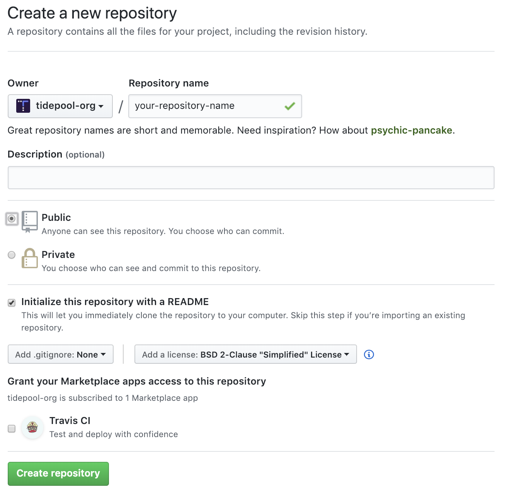

# Tidepool GitHub Processes

## Create Repository

Follow these directions to create a new Tidepool GitHub repository that conforms to the latest Tidepool standards for repository name, license, default branch, and branch protection.

### Prepare

Choose a descriptive name for the repository. It must be unique among all other Tidepool GitHub repositories. It must **not** include tidepool in the repository name, that is implied in the full URL (e.g. `github.com/tidepool-org/development`). Prefer lowercase and dashes to uppercase and underscore for consistency. Code names are **no longer allowed**. If you have questions, ask one of the Tidepool GitHub administrators.

Decide whether the repository should have public or private visibility. The repository should be private only if it will contain secrets, security-related matters, third-party proprietary information, or anything else that must not be made public. All other repositories should be public. If you are not sure, ask Howard or Tapani.

Login to GitHub as an Tidepool GitHub administrator. If you aren't a Tidepool GitHub administrator, then you'll need to get one to do the rest.

### Create Repository

Browse to [https://github.com/organizations/tidepool-org/repositories/new](https://github.com/organizations/tidepool-org/repositories/new) and:

1. Ensure the Owner is set to `tidepool-org`.
2. Enter the Repository name, as chosen above.
3. Add a Description, if desired, but this can easily be changed later.
4. Select Public or Private visibility, as chosen above.
5. Select Initialize this repository with a `README`.
6. From the Add `.gitignore` popup menu choose None.
7. From the Add a license popup menu choose `BSD 2-Clause "Simplified" License`.

For example:

Click Create repository.

### Create Develop Branch

Once the repository is created, create the `develop` branch so the repository can follow the [Tidepool Development Process], which closely models [GitFlow].

On the main repository page, click the Branch popup menu, type `develop`, and click `Create branch: 'develop' from 'master'`.

For example:

### Configure Repository Settings

Follow Default Repository Settings instructions below.

## Default Repository Settings

### Configure Options

Click the Settings icon in the upper-right corner. In the left menu, click Options, and:

1. Deselect Wikis, Issues, and Projects, unless otherwise required.
2. Deselect Allow squash merging and Allow rebase merging

For example:

### Configure Teams

Click the Settings icon in the upper-right corner. In the left menu, click Collaborators & teams and:

1. Click Add a team, choose Administrators and set permission to Admin
2. Click Add a team, choose Employees and set permission to Read
3. Click Add a team, choose the appropriate group (e.g. Engineering, Analytics) and set permission to Write

For example:

### Configure Default Branch and Branch Protection

Click the Settings icon in the upper-right corner. In the left menu, click Branches.

Select develop as the Default branch and click Update. Click `I understand`, update the default branch.

For both the master and develop branches, click Add rule to add a Branch protection rule, and:

1. Enter the branch name (i.e. master or develop)
2. Select Require pull request reviews before merging
3. Select Dismiss stale pull request approvals when new commits are pushed
4. Select Require status checks to pass before merging
5. Select Require branches to be up to date before merging
6. Note: If and when you add a Continuous Integration or other connection to this repository, you'll need to come back here and enable all available status checks
7. Select Include administrators

For example:

Click Create. Repeat for both `master` and `develop` branches.

For example:

[GitFlow]: https://nvie.com/posts/a-successful-git-branching-model/
[Tidepool Development Process]: ./development-process.md
